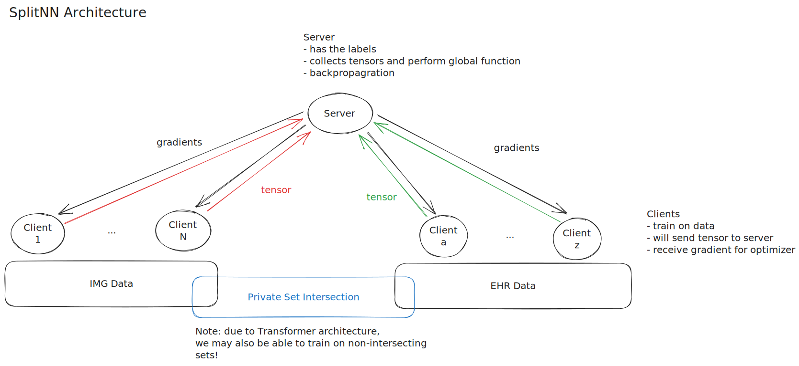

# Topic Exploration

The general topic is: **Privacy Preserving Vertical Federated Machine
Learning (VFL)**. Given an example research paper, a privacy preserving training
algorithm shall be developed.

**Note worthy Literature**
- A general [introduction][tut] (2021)

## Problems to solve

- Exploring the trade-off in accuracy, robustness, fairness and privacy. How do
we actually measure these properties?
- Generally, ML models remember the training data to some degree. This is a
privacy issue. What methods exist to prevent this?

## Privacy

The concept of privacy is subjective. Commonly, anonymization techniques are
applied to the data which may not be sufficient [Netflix][netfl].  Another
possible (popular) approach is the **Differential Privacy (DP)** definition. The
central idea is to make an individual contribution less significant (typically
using noise) such that a query on the data set does not reveal information about
a single individual [Wiki][diffpriv]. DP techniques are actually use in practice
by Google and Apple (privacy preserving user statistics). One may also apply
advanced cryptographic techniques to achieve privacy (FHE, SMPC). 

##  Vertical Federated Learning

A general idea on how this can be done using a splitNN architecture.

[tut]: lit/tut.pdf
[diffpriv]: https://en.wikipedia.org/wiki/Differential_privacy
[netfl]: https://www.cs.utexas.edu/~shmat/shmat_oak08netflix.pdf 